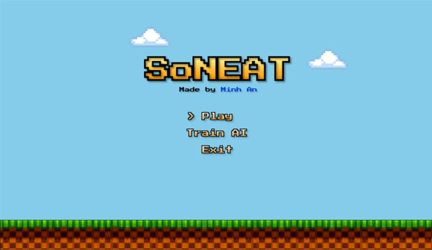
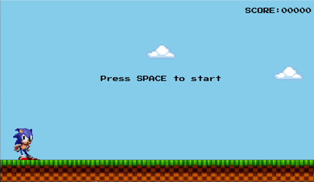
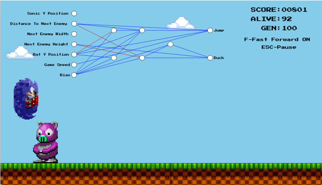

# SoNeat - AI Learning Game

## Project Overview

**SoNeat** is an innovative educational game developed as part of the custom program for Object-Oriented Programming (COS20007) unit at Swinburne University. 

The game features an endless runner, with the player controlling Sonic, or creating an AI to navigate obstacles using the [NEAT (NeuroEvolution of Augmenting Topologies)](https://nn.cs.utexas.edu/downloads/papers/stanley.ec02.pdf) algorithm. 

The core concept of the game is to provide users with an opportunity to observe the AI’s learning process and its ability to adapt to the environment over time.

## Achievements

This project was awarded the **Best Project Award** and the **Highest Achievement** in the Object-Oriented Programming (COS20007) unit at Swinburne University due to its innovative use of AI and its ability to teach complex concepts in an engaging way.

## Demo
Link to video demo [here](https://youtu.be/JZCMCS_Qe2o?si=WcSeDWuaC_lphNjh)

## Screenshots


*Figure 1: Main Menu Screen*



*Figure 2: Game Screen*



*Figure 3: Training Screen*


## Features

- **Endless Runner Gameplay**: Players can control Sonic in an endless runner style game.
- **AI Control**: Option to control the AI using the NEAT algorithm, which evolves and adapts its decision-making based on performance.
- **Real-Time AI Learning**: Watch the AI’s learning process as it attempts to navigate obstacles, showcasing the power of genetic algorithms.
- **Educational Tool**: The game serves as an educational experience, demonstrating complex AI concepts in an accessible way.

## Installation

### Prerequisites

Before running the game, you need to install **SplashKit** as it is the main library used in this project. Please follow the instructions below to install SplashKit:

1. Download and install **SplashKit** by following the official [SplashKit installation guide](https://www.splashkit.io/).
2. Ensure that you have the .NET SDK 8.0 installed. If not, you can download it from [here](https://dotnet.microsoft.com/download).

### Running the Program

1. Clone or download this repository to your local machine.
2. Open a terminal and navigate to the folder where the project is located.
3. Run the following command:

    ```bash
    skm dotnet run
    ```

This command will launch the game, allowing you to interact with the AI and see its learning process in action.

## Gameplay Instructions

- **Player Control**: Use the keyboard to control Sonic's movement and attempt to navigate the endless runner course.
- **AI Control**: Enable the NEAT algorithm to control the AI, which will learn and adapt its strategy to overcome obstacles.

## Acknowledgments

- **SplashKit**: For the game development framework.
- **NEAT Algorithm**: For providing the basis for the AI learning in this game.
- **Swinburne University**: For the opportunity to develop this project as part of the COS20007 unit.

